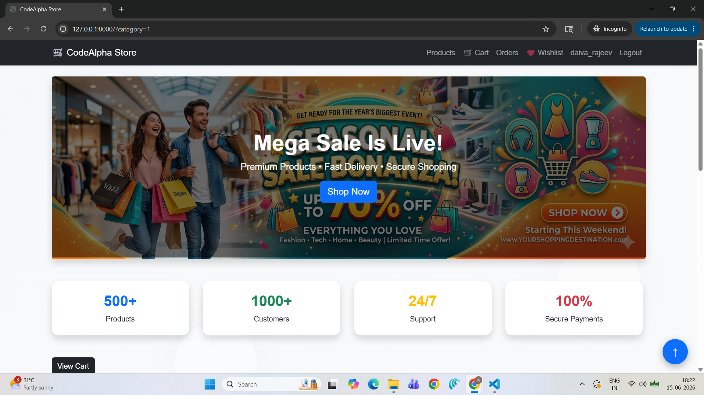
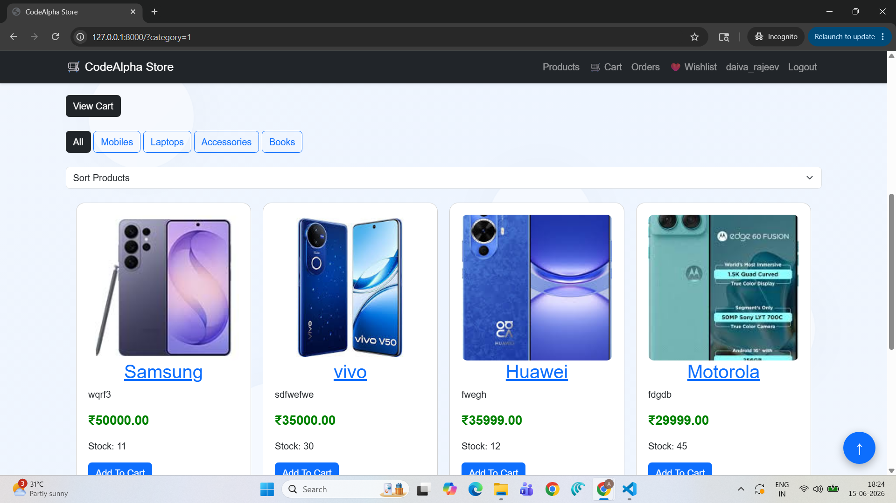
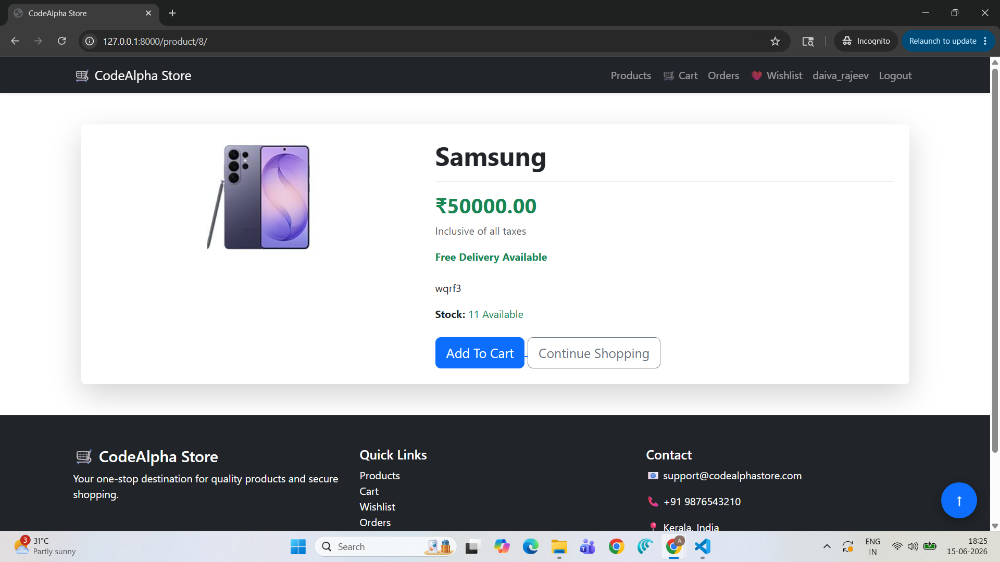
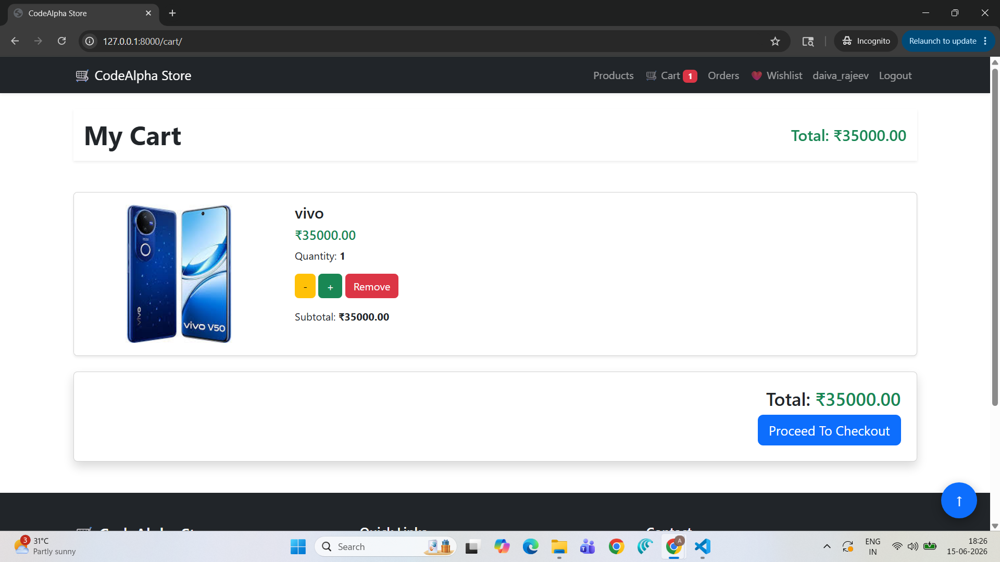
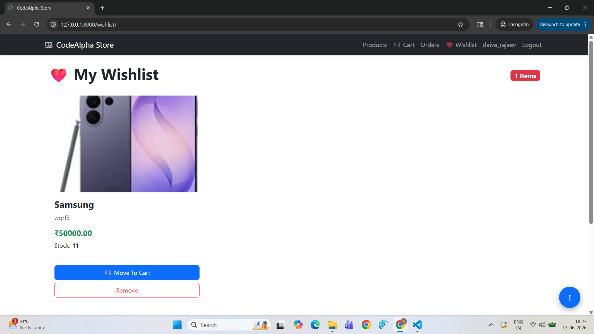
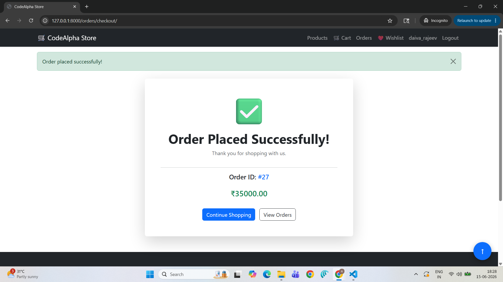
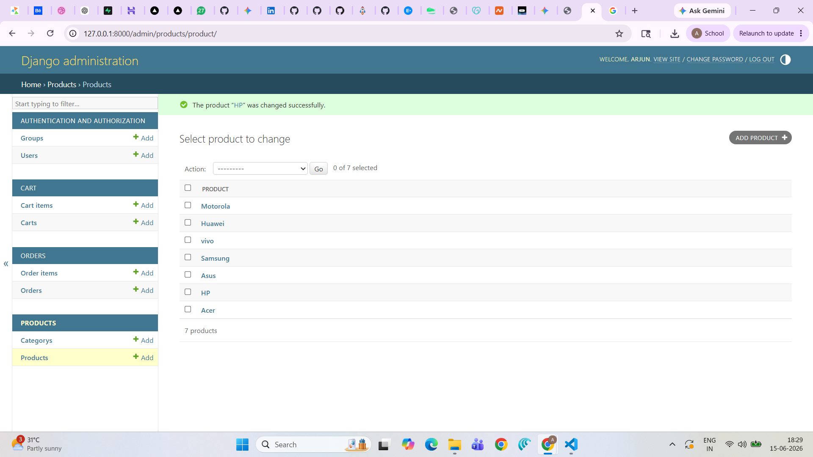

# 🛒 CodeAlpha E-Commerce Website



A fully functional E-Commerce Web Application developed using **Django**, **HTML**, **CSS**, **Bootstrap**, and **SQLite** as part of the **CodeAlpha Internship Program**.

This project provides a complete online shopping experience with user authentication, product management, cart functionality, wishlist management, order processing, stock management, category filtering, pagination, sorting, and a modern responsive user interface.

---

## 🚀 Features

### 👤 User Authentication

* User Registration
* User Login
* User Logout
* Secure Authentication System

### 🛍 Product Management

* View All Products
* Product Detail Page
* Product Images
* Product Categories
* Product Descriptions
* Product Pricing
* Product Stock Information

### 🛒 Shopping Cart

* Add Products to Cart
* View Cart Items
* Update Product Quantity
* Remove Products from Cart
* Automatic Cart Total Calculation

### ❤️ Wishlist

* Add Products to Wishlist
* Remove Products from Wishlist
* Separate Wishlist Page

### 📦 Order Management

* Place Orders
* Order Confirmation Page
* Order History Page
* View Previous Orders

### 📊 Stock Management

* Automatic Stock Reduction After Purchase
* Out-of-Stock Product Detection
* Stock Availability Display

### 🔍 Product Filtering & Sorting

* Filter Products by Category
* Sort by Price (Low to High)
* Sort by Price (High to Low)
* Sort by Newest Products

### 📄 Pagination

* Product Pagination
* Easy Navigation Between Pages

### 🎨 Professional UI Enhancements

* Responsive Navigation Bar
* Hero Banner Section
* Statistics Cards
* Product Hover Animations
* Smooth Button Animations
* Floating Effects
* Professional Footer
* Scroll-to-Top Button
* Modern Card Design

### 🔧 Admin Panel

* Django Admin Dashboard
* Manage Products
* Manage Categories
* Manage Orders
* Manage Users
* Manage Stock

---

## 🛠 Technologies Used

### Backend

* Python
* Django

### Frontend

* HTML5
* CSS3
* Bootstrap 5

### Database

* SQLite3

### Additional Libraries

* Pillow (Image Upload Support)

---

## 📁 Project Structure

```text
CodeAlpha_Ecommerce/
│
├── accounts/
│   ├── login
│   ├── register
│
├── products/
│   ├── product list
│   ├── product detail
│
├── cart/
│   ├── add to cart
│   ├── cart management
│
├── wishlist/
│   ├── wishlist management
│
├── orders/
│   ├── checkout
│   ├── order history
│
├── templates/
│   ├── base.html
│   ├── products
│   ├── accounts
│   ├── orders
│   ├── wishlist
│
├── media/
│
├── db.sqlite3
│
└── manage.py
```

---

## ⚙️ Installation

### 1. Clone Repository

```bash
git clone https://github.com/Arjun182-web/CodeAlpha-Ecommerce-Website.git
```

### 2. Navigate to Project Folder

```bash
cd CodeAlpha-Ecommerce-Website
```

### 3. Create Virtual Environment

```bash
python -m venv venv
```

### 4. Activate Virtual Environment

Windows:

```bash
venv\Scripts\activate
```

### 5. Install Dependencies

```bash
pip install -r requirements.txt
```

### 6. Run Migrations

```bash
python manage.py migrate
```

### 7. Create Superuser

```bash
python manage.py createsuperuser
```

### 8. Start Development Server

```bash
python manage.py runserver
```

### 9. Open Browser

```text
http://127.0.0.1:8000/
```

---

## 🔐 Admin Access

Open:

```text
http://127.0.0.1:8000/admin/
```

Login using the superuser credentials created during setup.

---

## 📸 Screenshots

## 📸 Project Preview

### 🏠 Home Page


### 🛍 Product Listing



### 📦 Product Detail



### 🛒 Shopping Cart



### ❤️ Wishlist



### 📋 Order History



### ⚙️ Admin Dashboard




---

## 🎯 Internship Objective

The objective of this project was to build a complete E-Commerce Website that demonstrates:

* Full-Stack Web Development
* Database Integration
* Authentication & Authorization
* CRUD Operations
* Responsive UI Design
* Django Framework Usage
* Real-World E-Commerce Functionality

---

## 📈 Future Enhancements

* Online Payment Gateway Integration
* Product Search Functionality
* Product Reviews & Ratings
* Email Notifications
* User Profile Management
* Invoice Generation
* Sales Dashboard Analytics
* Product Recommendations

---

## 👨‍💻 Developer

**Arjun Roy**

B.Tech Computer Science & Engineering
College of Engineering Perumon

📧 Email: [arjunroy3355@gmail.com](mailto:arjunroy3355@gmail.com)

🔗 LinkedIn: [www.linkedin.com/in/arjun-roy-13646732a](http://www.linkedin.com/in/arjun-roy-13646732a)

🔗 GitHub: https://github.com/Arjun182-web

---

## 📜 License

This project was developed for educational and internship purposes under the CodeAlpha Internship Program.
