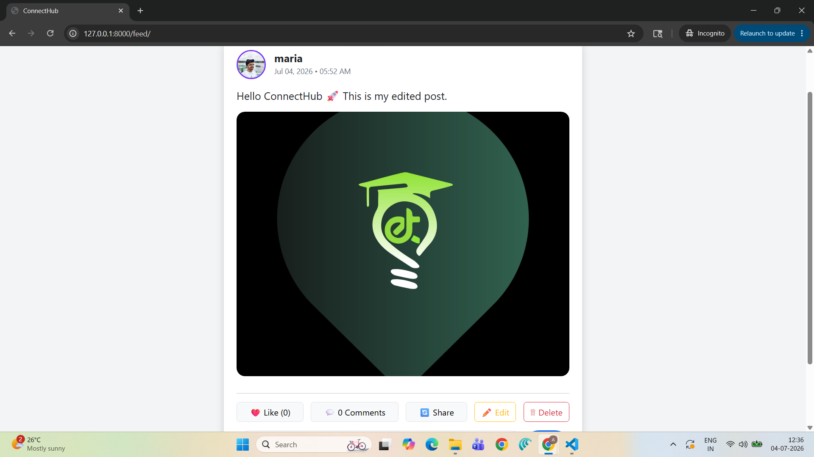
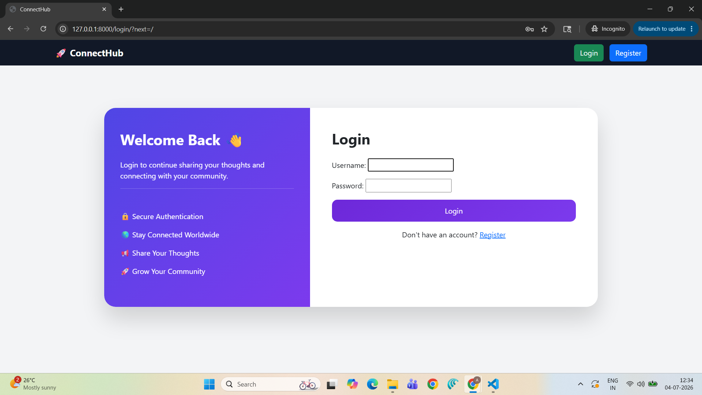
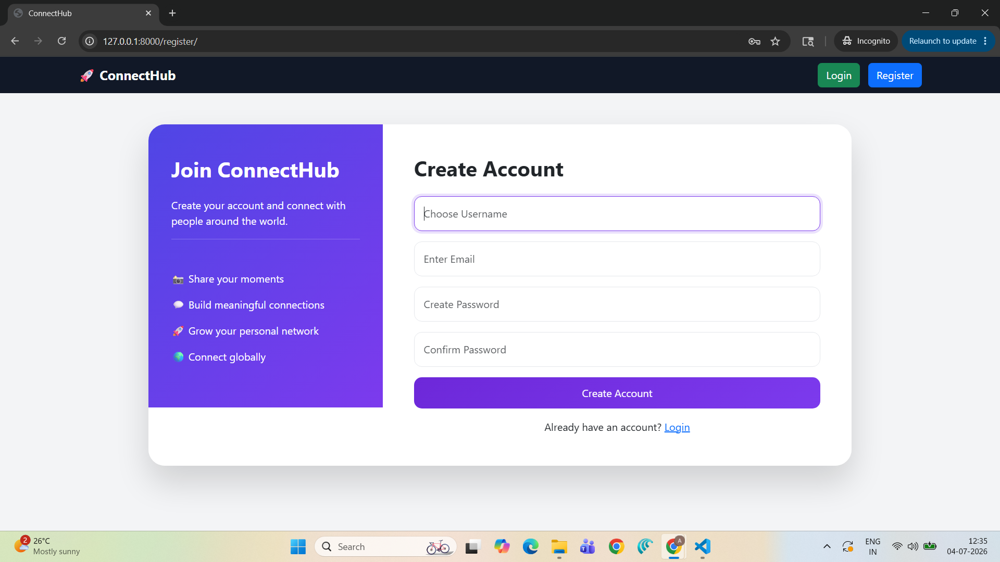
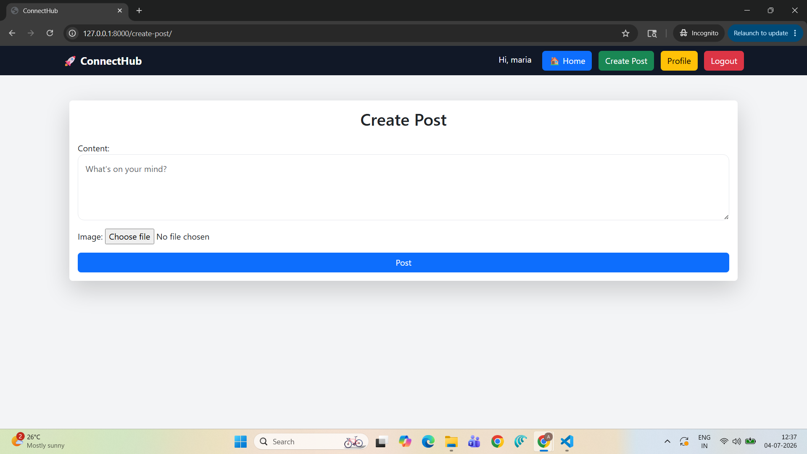
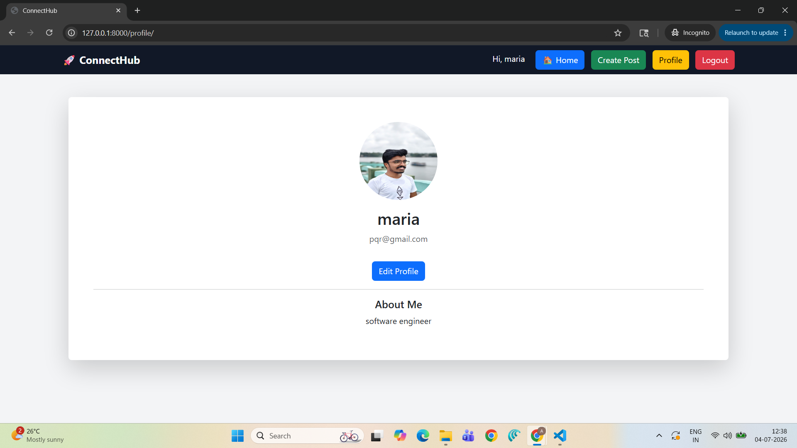
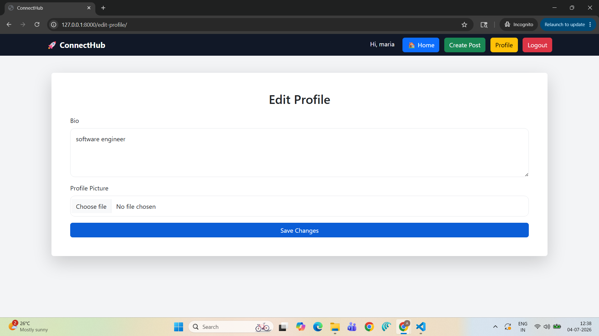
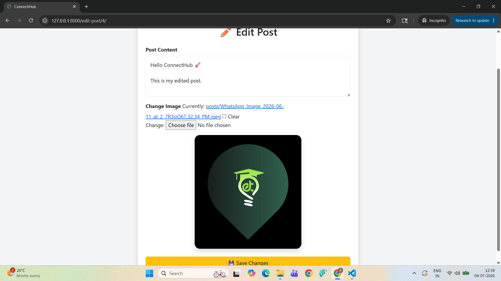
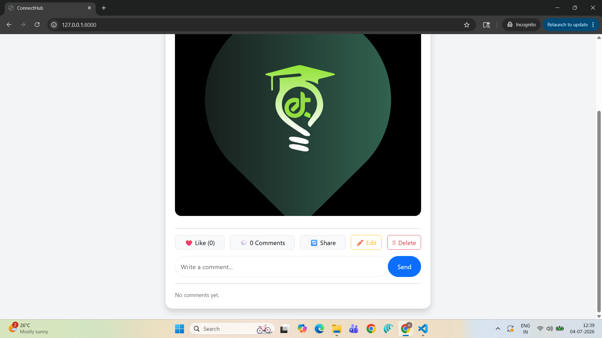

# 🚀 ConnectHub - Social Media Platform



A modern **Social Media Platform** developed using **Django**, **Bootstrap**, and **SQLite** as part of the **CodeAlpha Python Development Internship**.

ConnectHub allows users to create profiles, share posts with images, like and comment on posts, and manage their own content through a clean and responsive interface.

---

## 📌 Features

### 🔐 Authentication
- User Registration
- User Login & Logout
- Secure Authentication

### 👤 User Profile
- Profile Page
- Edit Profile
- Upload Profile Picture
- Bio Section

### 📝 Posts
- Create New Posts
- Upload Images
- View Feed
- Edit Own Posts
- Delete Own Posts

### ❤️ Like System
- Like Posts
- Unlike Posts
- Live Like Count

### 💬 Comment System
- Add Comments
- View Comments
- Comment Count

### 🎨 User Interface
- Responsive Bootstrap Design
- Premium Login & Register Pages
- Modern Feed Layout
- Mobile-Friendly Interface

### 🔒 Security
- Users can edit only their own posts
- Users can delete only their own posts
- Secure authentication using Django

---

# 🛠️ Tech Stack

- Python
- Django
- HTML5
- CSS3
- Bootstrap 5
- JavaScript
- SQLite

---

# 📂 Project Structure

```
connecthub/
│
├── connecthub/
├── socialmedia/
├── media/
├── templates/
├── static/
├── manage.py
└── README.md
```

---

# 🚀 Installation

## Clone Repository

```bash
git clone https://github.com/Arjun182-web/CODEALPHA_TASKS.git
```

## Navigate

```bash
cd CODEALPHA_TASKS/connecthub
```

## Create Virtual Environment

```bash
python -m venv venv
```

### Windows

```bash
venv\Scripts\activate
```

### Linux / macOS

```bash
source venv/bin/activate
```

## Install Dependencies

```bash
pip install -r requirements.txt
```

## Run Migrations

```bash
python manage.py migrate
```

## Start Server

```bash
python manage.py runserver
```

Open:

```
http://127.0.0.1:8000/
```

---

# 📸 Project Screenshots

## 🔐 Login Page



---

## 📝 Register Page



---

## 🏠 Feed


---

## ➕ Create Post



---

## 👤 Profile



---

## ✏️ Edit Profile



---

## 📝 Edit Post



---

## ❤️ Likes & 💬 Comments


---

# 🎯 Internship Task

**Organization:** CodeAlpha

**Task:** Social Media Platform

---

# 👨‍💻 Developed By

**Arjun Roy**

B.Tech Computer Science & Engineering

Python Developer | Full Stack Web Development Enthusiast

GitHub: https://github.com/Arjun182-web